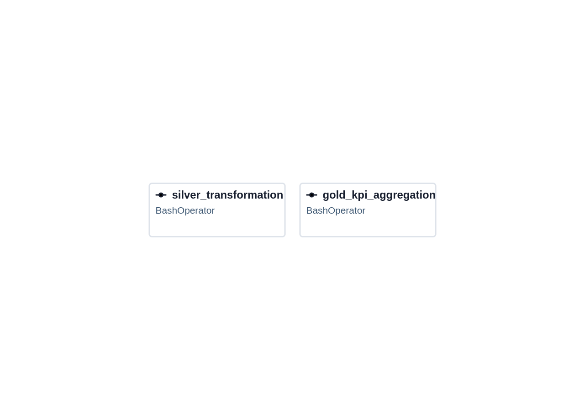
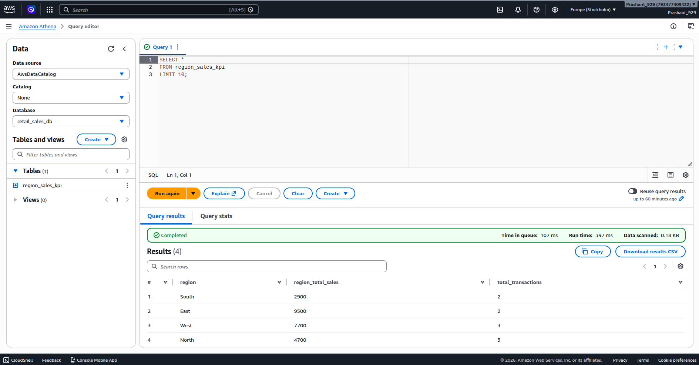
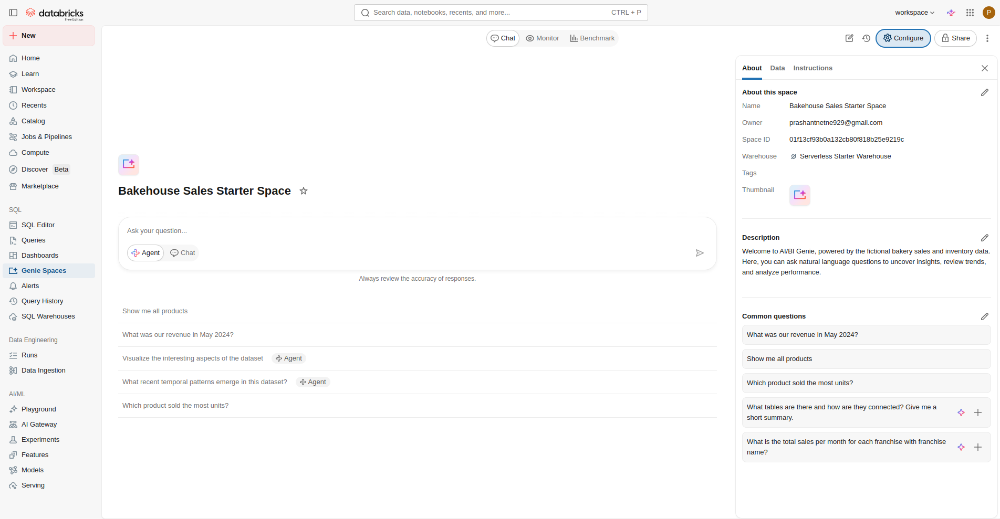
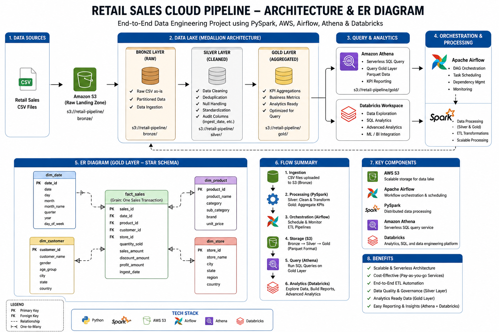

# Retail Sales Cloud Pipeline 🚀

## Project Overview
This project is an end-to-end Data Engineering pipeline built using PySpark, Apache Airflow, AWS S3, Athena, and Databricks.

The pipeline processes retail sales transaction data through Bronze, Silver, and Gold layers using Medallion Architecture principles.

---

# Tech Stack

- PySpark
- Apache Airflow
- AWS S3
- AWS Athena
- Databricks
- Parquet
- Git & GitHub

---

# Architecture

Raw CSV Data → PySpark ETL → S3 Data Lake → Silver Layer → Gold KPI Layer → Athena Querying → Databricks Analytics

---

# Pipeline Layers

## Bronze Layer
- Raw retail sales data ingestion
- CSV source files stored in S3

## Silver Layer
- Removed duplicate records
- Removed invalid quantity and price values
- Removed NULL customer IDs
- Standardized region names
- Added processed timestamp
- Generated total_sales column

## Gold Layer
- Region-wise KPI aggregation
- Total sales calculations
- Transaction metrics generation

---

# Key Features

- Data Quality Validation
- ETL Processing
- Parquet Optimization
- Cloud Storage Integration
- Athena SQL Querying
- Airflow DAG Orchestration
- Databricks Integration

---

# Sample Transformations

## Duplicate Removal
```python
df.dropDuplicates()
```

## Invalid Data Filtering
```python
df.filter(col("quantity") > 0)
```

## KPI Aggregation
```python
groupBy("region").agg(sum("total_sales"))
```

---

# Future Enhancements

- Delta Lake Integration
- Kafka Streaming Pipeline
- Snowflake Integration
- Docker Deployment
- CI/CD Automation
- Terraform Infrastructure

---

# Author

Prashant Netne

---


## Airflow Pipeline

This Airflow DAG orchestrates the complete ETL workflow for the retail sales pipeline.  
The pipeline executes Silver layer transformations followed by Gold KPI aggregation using PySpark jobs.



## Athena Query Results

AWS Athena is used to query the Gold layer parquet data stored in Amazon S3.  
This enables serverless SQL analytics and KPI reporting directly on the cloud data lake.



## Databricks Workspace

Databricks workspace integration is used for cloud-based analytics, SQL warehousing, and scalable data engineering workflows.



# Architecture & ER Diagram

This diagram represents the complete end-to-end Retail Sales Cloud Pipeline architecture built using PySpark, AWS S3, Athena, Airflow, and Databricks.

The project follows Medallion Architecture principles using Bronze, Silver, and Gold layers for scalable and analytics-ready data processing.

The ER diagram also demonstrates the analytical star schema used for KPI reporting and business intelligence workloads.

